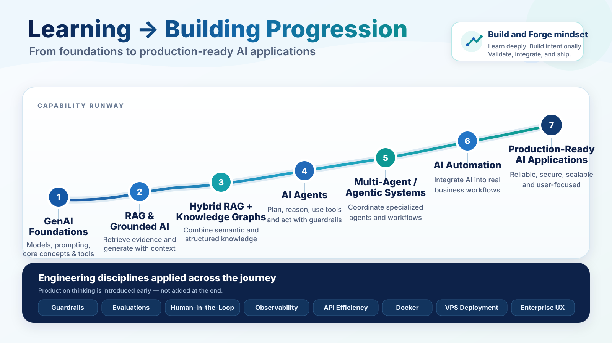

### BUILD • KNOW • EVOLVE

# Arun Srinivasan

**Generative AI · RAG · AI Agents · Agentic Systems · AI Automation · Cloud & Delivery Engineering**

I build hands-on AI systems with an emphasis on **grounded outputs, human oversight, guardrails, evaluations, observability, efficient execution, and deployment discipline**.

---

## 🌐 My Portfolio

A dedicated portfolio experience bringing together my **BUILD, KNOW, and EVOLVE** work is currently being prepared.

**Portfolio Website — Coming Soon**

---

## 🚀 Flagship Product Builds — Private

Commercial product builds are maintained in **private repositories** to protect product IP and implementation details. The public profile highlights the product capability and outcomes without exposing source code.

| Product | What it does | Live Demo | Repository |
|---|---|---|---|
| **Delivery Governance AI** | AI-powered delivery governance platform connecting project evidence, meetings, governance registers, grounded Ask AI, insights, and human-approved actions. | **Coming Soon** | **Private** |

---

## 🔨 Weekend Build & Forge

**Build. Test. Learn. Ship.**

A recurring weekend build series for focused experiments, controlled comparisons, and practical AI engineering.

| Build | Project | Focus |
|---|---|---|
| **Build 01** | [**AI Agent Olympics**](https://github.com/arun-srinivasan-builds/ai-agent-olympics) | Controlled benchmark comparing OpenAI Agents SDK and Microsoft AutoGen across research, resilience, misinformation, prompt injection, and efficiency events. |

---

## 📚 Learning Builds & Labs

Hands-on learning repositories, buildathons, capstones, and experiments that capture the progression from foundations through RAG, agents, automation, and applied AI.

### Applied AI & RAG

| Project | Focus |
|---|---|
| [**AI Migration Advisor**](https://github.com/arun-srinivasan-builds/AI-Migration-Advisor) | Applied-AI learning prototype for enterprise migration assessment using Python, Streamlit, Ollama, and a local LLM. |
| [**Enterprise AI Copilot**](https://github.com/arun-srinivasan-builds/Enterprise-AI-Copilot) | Learning build exploring hybrid knowledge assistance, structured retrieval, semantic search, source attribution, and entity-aware routing. |
| [**FoodSafe AI**](https://github.com/arun-srinivasan-builds/FoodSafe_AI) | Buildathon applying domain-focused RAG to food-safety intelligence. |
| [**Hybrid RAG — FAISS + Neo4j**](https://github.com/arun-srinivasan-builds/Hybrid-RAG-FAISS-Neo4j) | Hands-on Hybrid RAG exercise combining vector retrieval with a Neo4j knowledge graph. |
| [**RAG Chatbot — Knowledge Graph, Guardrails & Evals**](https://github.com/arun-srinivasan-builds/RAG_Chatbot_Knowledge_Graph_Guardrail_Evals) | Learning build combining RAG, knowledge graphs, guardrails, and evaluations. |
| [**PDF RAG**](https://github.com/arun-srinivasan-builds/RAG-PDF) | Foundational document-grounded RAG exercise. |
| [**LangChain · OpenAI · LangSmith**](https://github.com/arun-srinivasan-builds/LangChain-OpenAI-LangSmith) | LangChain application learning with OpenAI and LangSmith observability. |

### AI Agents & Automation

| Project | Focus |
|---|---|
| [**CrewAI Customer Support**](https://github.com/arun-srinivasan-builds/CrewAI-Customer-Support) | Buildathon exploring sequential specialized-agent orchestration with CrewAI. |
| [**AutoGen Customer Support Buildathon**](https://github.com/arun-srinivasan-builds/AutoGen-Customer-Support-Buildathon) | Buildathon exploring multi-agent orchestration with AutoGen. |
| [**AI Fabric Migration — n8n Automation**](https://github.com/arun-srinivasan-builds/AI-Fabric-Migration-n8n-Automation) | Learning capstone integrating AI-powered migration assessment with n8n workflow automation. |
| [**RPA Automation**](https://github.com/arun-srinivasan-builds/RPA-Automation) | RPA and workflow-automation foundations and implementations. |

### Foundations

| Project | Focus |
|---|---|
| [**GenAI Basics**](https://github.com/arun-srinivasan-builds/GenAI-Basics) | Hands-on Generative AI foundations and core concepts. |
| [**Basic GenAI Application — LangChain Mastery Demo**](https://github.com/arun-srinivasan-builds/Basic-GenAI-Application-LangChain-Mastery-Demo) | Foundational LangChain and Generative AI application exercise. |
| [**API & Streamlit**](https://github.com/arun-srinivasan-builds/API-and-Streamlit) | Hands-on API integration and Streamlit application development. |
| [**Cloud Engineering Systems**](https://github.com/arun-srinivasan-builds/Cloud-Engineering-Systems) | Hands-on cloud and systems engineering foundations. |

---

## 🧭 Learn → Build → Forge → Production

This reflects how I approach capability development: learn the foundations, build hands-on, forge the ideas through focused experiments, and carry the strongest patterns into production-oriented systems.

---

## ⚙️ Engineering Approach

Across projects, I increasingly apply the same engineering disciplines expected in robust AI systems:

**Grounded Retrieval · Guardrails · Evaluations · Human-in-the-Loop · Observability · API Efficiency · Docker · VPS Deployment · Responsive Enterprise UX**

The goal is not only to make AI features work, but to make the surrounding system **understandable, testable, efficient, deployable, and trustworthy**.

---

## 🎯 Current Focus

- Advancing **Delivery Governance AI** toward a production-ready product experience.
- Continuing **Weekend Build & Forge** as a recurring practical experimentation and engineering series.
- Deepening domain-specific **RAG, agentic systems, and AI automation** patterns.
- Strengthening production disciplines across security, evaluation, observability, responsive UX, Dockerization, and deployment.

---

## 💡 Build Philosophy

> **Learn deeply. Build intentionally. Validate visibly. Deploy responsibly. Improve continuously.**

The learning repositories are intentionally retained because they show the engineering progression behind the private flagship product and ongoing build experiments.

---

### Explore the public repositories above to follow the build journey.

